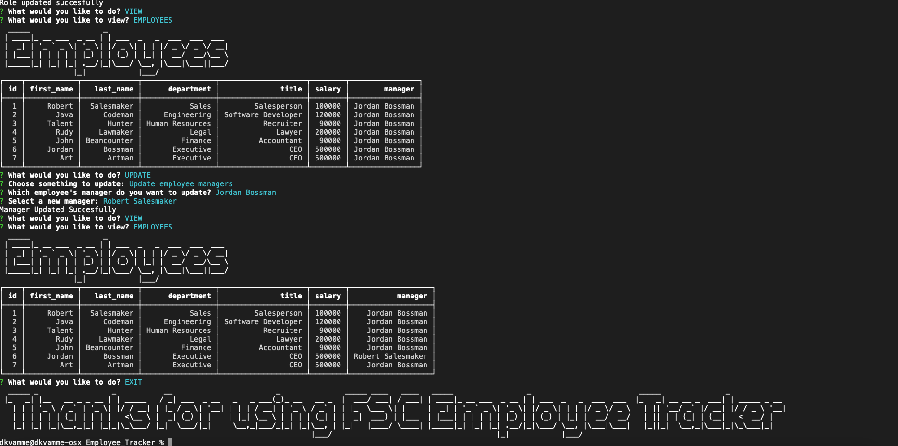

<h1 align="center">Unit 12 MySQL Home: Employee Tracker</h1>

## Employee_Tracker

- [Description](#description)
- [Installation](#installation)
- [Usage](#usage)
- [Contributing](#contributing)
- [Questions](#questions)

## Description

This is a command line application that can be used to view an company organization chart. The user can view departments, roles and employees. The user can also add departments, roles and employees. The user is also able to update employee roles and the manager they report to.

This application uses MySQL database to store and update data from the user input.

Gif showing the functionality of the application:

The full movie file showing functionality of the application can be found [here](./src/tracker.mp4)

Screenshot of the completed output:

## Installation

`npm init`

`npm install mysql`

`npm install inquirer`

`npm install console-table-printer`

`npm install figlet`

## Usage

Run the following command at the root of the directory and you will be prompted with questions:

`node index.js`

## Contributing

:octocat: [Doug Kvamme](https://github.com/kvadou)

## Questions

Contact me with any questions: [email](mailto:dougkvamme@gmail.com) , [GitHub](https://github.com/kvadou) 
